---

layout: default

title: VR in WEB

---
#  {#splash}

## 
{:.cover}

## &nbsp;
{:.center}
[https://bastsoft.github.io/vrinweb](https://bastsoft.github.io/vrinweb)
{:.tmp}

## &nbsp;
{:.images .two}

<!-- blank line -->

  <iframe width="420" height="315" src="https://www.youtube.com/embed/zA2tSoXCOnk?start=120" frameborder="0" allowfullscreen></iframe>
   
  
  <a target="_blank" href="https://www.youtube.com/watch?v=zA2tSoXCOnk&t=447s">
  Cycling Britain in VR. 1400-1500km
  </a>
  

  <iframe width="420" height="315" src="https://www.youtube.com/embed/jKrywMKnsUc" frameborder="0" allowfullscreen></iframe>
   
   
    <a target="_blank" href="https://www.youtube.com/watch?v=jKrywMKnsUc&t=300s">
    VR Cycling Experience
    </a>
   

<!-- blank line -->

## 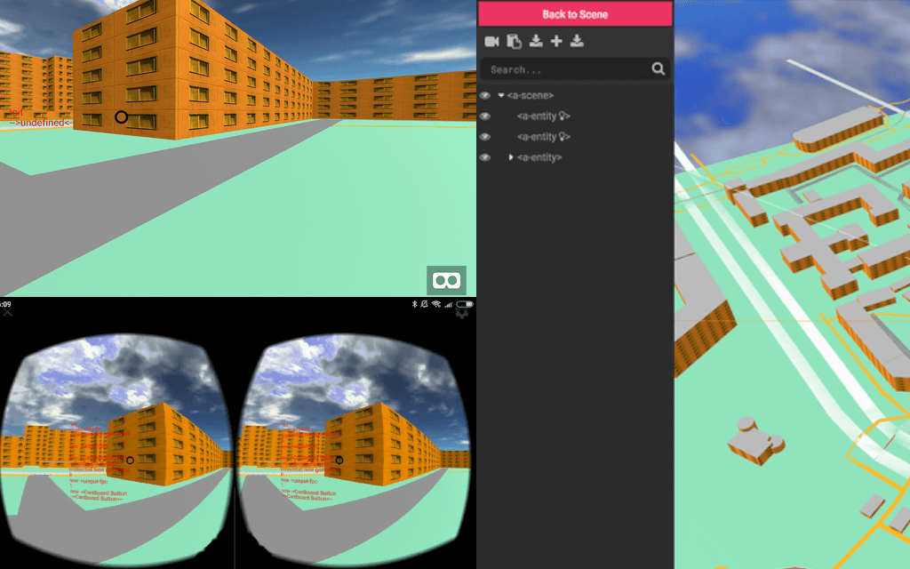
{:.cover}

## &nbsp;
{:.images .two}

<!-- blank line -->

  <iframe width="420" height="315" src="https://www.youtube.com/embed/iUamlshzIHY?start=250" frameborder="0" allowfullscreen></iframe>
   
  
  <a target="_blank" href="https://www.youtube.com/watch?v=iUamlshzIHY&t=250s">
  frontday #7
  </a>
  

<!-- blank line -->

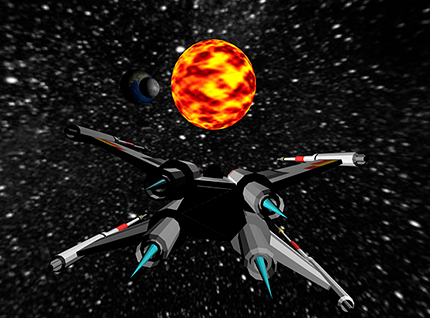 
[workshop for GEEK KIDS](https://vk.com/itgeekkids?w=wall-165546976_50)

## &nbsp;

- HollyJS 2017
    - Martin Splitt - [WebVR is the next frontier](https://www.youtube.com/watch?v=39MiUkGSEks)
    - Денис Радин - [web-приложение в виртуальную реальность](https://www.youtube.com/watch?v=8FLhLWzeKG0)
- Google Chrome Developers chanel
    - [Designing a WebVR game with A-Frame](https://www.youtube.com/watch?v=KeYv7BSn4N4)
- Google I/O 17
    - [Building Virtual Reality on the Web with WebVR](https://www.youtube.com/watch?v=jT2mR9WzJ7Y)

## &nbsp;
{:.with-big-quote}
> зачем? кому это нужно?

{:.note}

## caniuse webgl
{:.center}
[https://caniuse.com/#feat=webgl](https://caniuse.com/#feat=webgl)
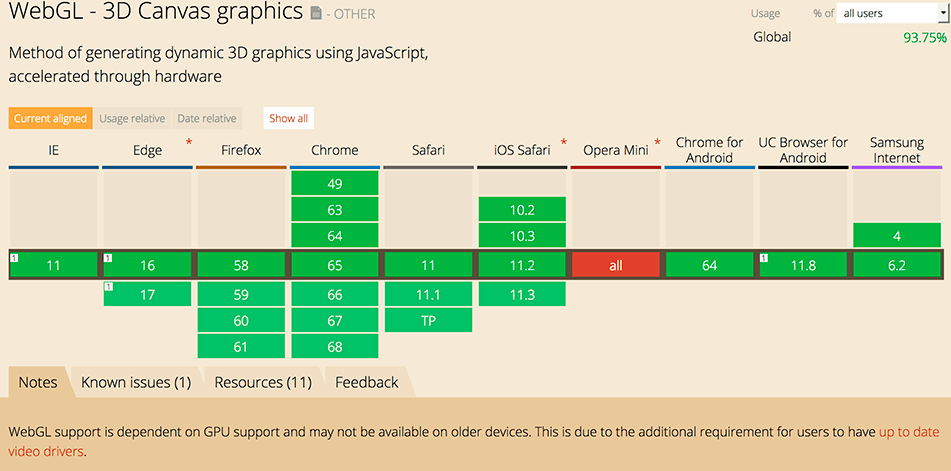{:.tmp}

## 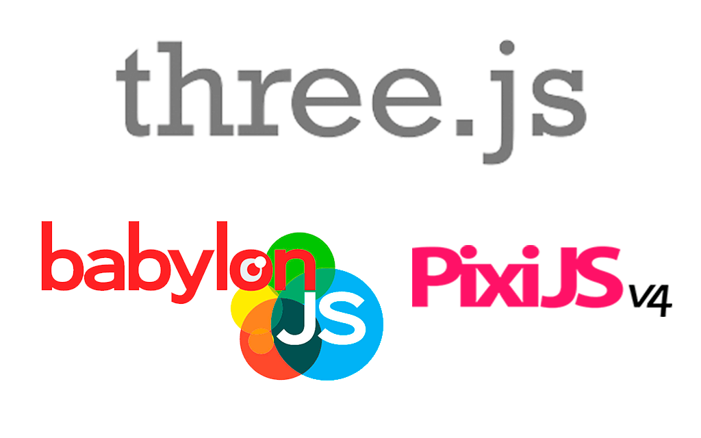
{:.cover}

## WebVR

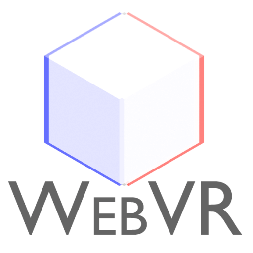{:.right-image}

* navigator.getVRDisplays
    * VRDisplay.requestAnimationFrame
    * VRDisplay.getImmediatePose
    * VRPose.position
    * VRPose.orientation
    * Gamepad.displayId
* [https://webvr.info/](https://webvr.info/)
* [chrome://flags/#enable-webvr](chrome://flags/#enable-webvr)

## caniuse webVR
{:.center}
[https://caniuse.com/#search=WebVR](https://caniuse.com/#search=WebVR)
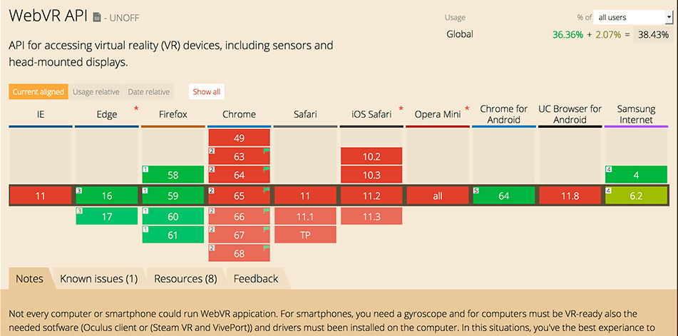{:.tmp}

## A-FRAME

{:.right-image}

* [https://aframe.io/](https://aframe.io/)
* Features
    * Simple, Declarative HTML
    * entity-component-system (ECS)
    * visual 3D inspector
* Base on
    * three.js

## price & quality experience

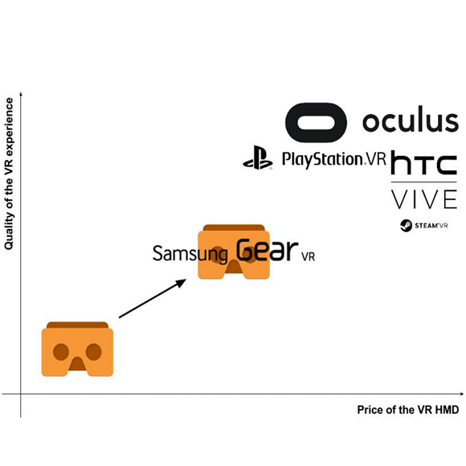{:.right-image}

* PC base
    * [HTC vive](https://www.vive.com/ru/) - 44 990
    * [playstation vr](https://store.sony.ru/playstation/playstation_vr) - 22 999
    * [Oculus Rift](https://www.oculus.com/rift) - 25 000 (399$)
* Mobile base
    * [Google Daydream](https://virtuality.club/store/ochki-virtualnoy-realnosti-dlya-smartfonov/google-daydream-view?rs=yamarket20_21256931_856) - 8600
    * [Gear-vr](https://www.oculus.com/gear-vr/) - 8200 (130$)
    * [Cardboard](https://www.dns-shop.ru/product/bef09dc3b13b3330/ocki-virtualnoj-realnosti-blaks-cardboard-v3-20-3d-glasses) - 300

## VR sales 2016
{:.center}
[SuperData Research 2016](https://haptic.al/latest-virtual-reality-headset-sales-so-far-9553e42f60b5)
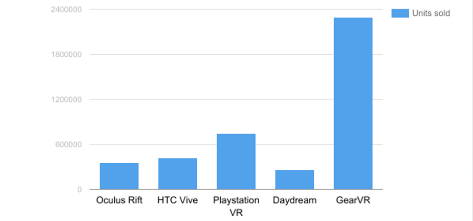{:.tmp}

## VR sales 2016 with Cardboard
{:.center}
[MWC 2017 Google Cardboard - 10 млн](https://androidinsider.ru/gadzhety/mwc-2017-google-10-mln-cardboard-uzhe-postavleno-160-mln-zagruzok-prilozheniy.html)
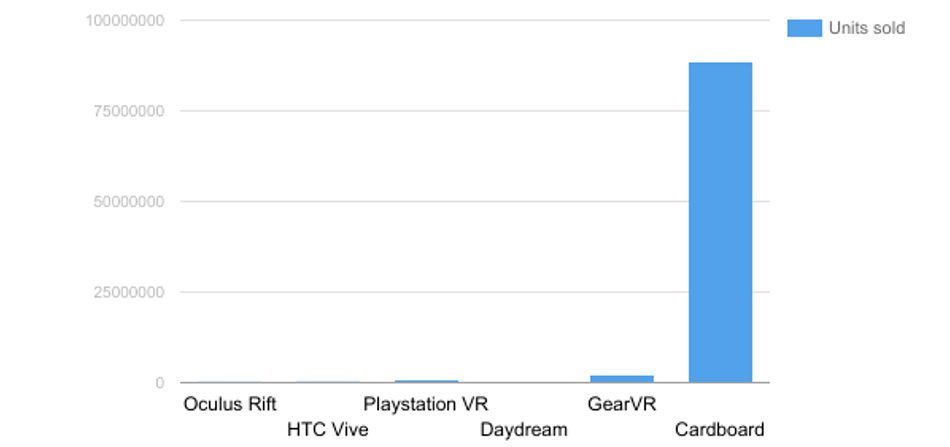{:.tmp}

## money in PC VR

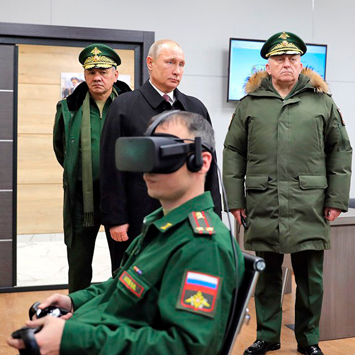{:.right-image}

* Корпоративные тренажеры
    * [СИБУР - ремонт компрессора](https://www.youtube.com/watch?v=nSrtElkWwNQ)
    * [РЖД - тренажер электромеханика](https://www.youtube.com/watch?v=9kEuSFc75D8)
    * [Сбербанк](https://www.youtube.com/watch?v=SAyxbIKtFMw)
* парки - VR аттракцион
    * [THE VOID (USA, UK)](https://www.thevoid.com/)
    * [anviovr (Москва)](https://ru.anviovr.com/)
    * [ENGAGE (Санкт-Петербург)](http://engagevr.ru/)

## money in mobile VR

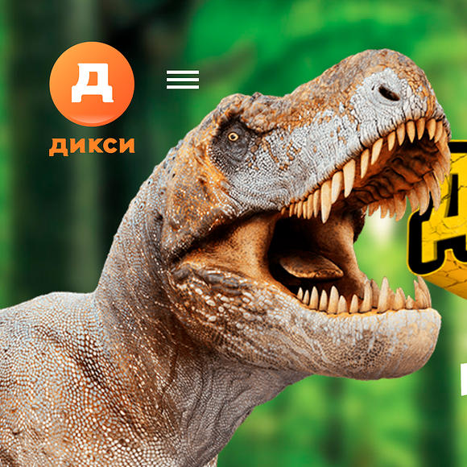{:.right-image}

* 360 видео
    * [Kaspersky Земля 2050](https://2050.earth/)
    * [Сбербанк](https://www.youtube.com/watch?v=UdHXPzFyPhk)
* Маркетинг
    * [Дикси, смотри динозавры](http://www.dino.dixy.ru/)
    * [Volvo XC90](https://www.volvocars.com/us/about/our-stories/google-cardboard)
    * [Kaspersky Virus Hunters VR](https://www.kaspersky.ru/about/press-releases/2017_kaspersky-lab-has-released-a-mobile-vr-game-about-hunting-for-viruses)

## webVR use case

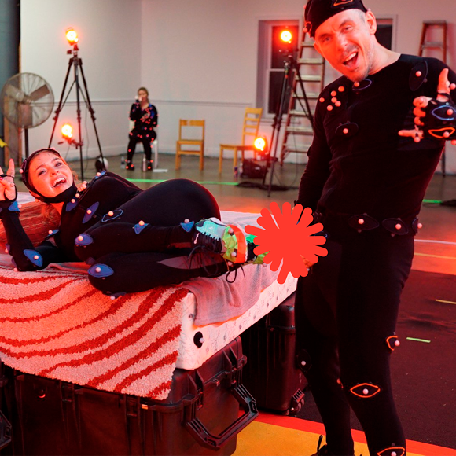{:.right-image}

* Порно
    * [camasutravr](http://www.camasutravr.com)
* Маркетинг
    * [Renault KADJAR](https://kadjar.littleworkshop.fr/)
    * [emirates airlines](https://www.emirates.com/english/experience/seating/3d-seatmap/)
    * [netflix strangerthings](http://www.strangerthingscountdown.com/)
* Продажа недвижимости
    * [matterport](https://matterport.com/try-it/)
    * [archilogic.com](https://appcreator.3d.io)

## &nbsp;
{:.with-big-quote}
> Требование рынка к webVR это  интерактивные панорамы

{:.note}

## &nbsp;
{:.images .two}

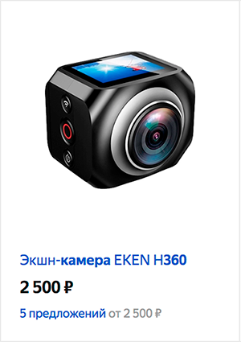

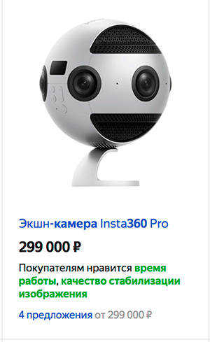

## AFrame - 360° Image
[demo](https://www.codeseek.co/preview/KyNwpZ)
~~~ html
<!DOCTYPE html>
<html>
<head>
  <title>AFrame - 360° Image</title>
</head>
<body>
<a-scene>
  <a-sky src="puydesancy.jpg" rotation="0 -130 0"></a-sky>
</a-scene>

</body>
</html>
~~~
{: .html}

## 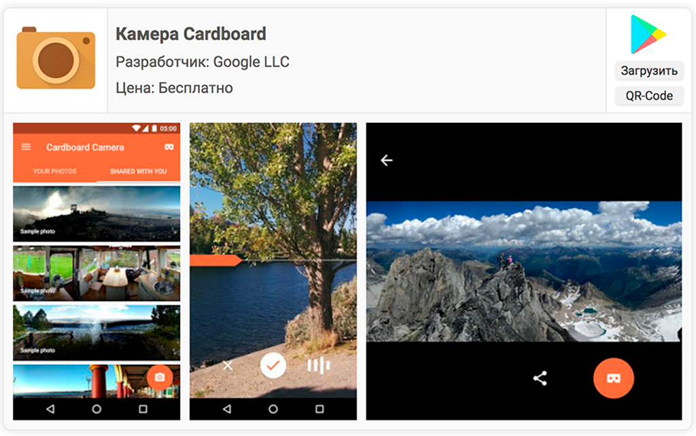
{:.cover}

## 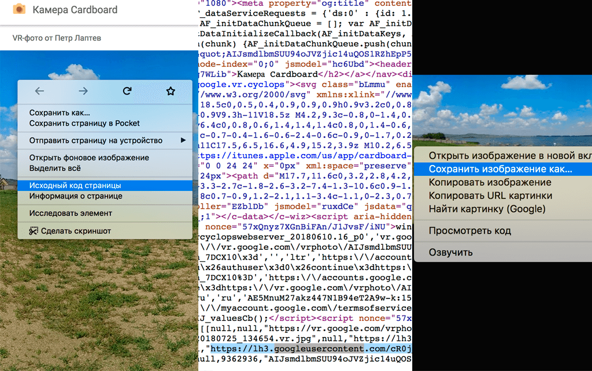
{:.cover}

## &nbsp;
{:.center}
[https://storage.googleapis.com/cardboard-camera-converter/index.html](https://storage.googleapis.com/cardboard-camera-converter/index.html)
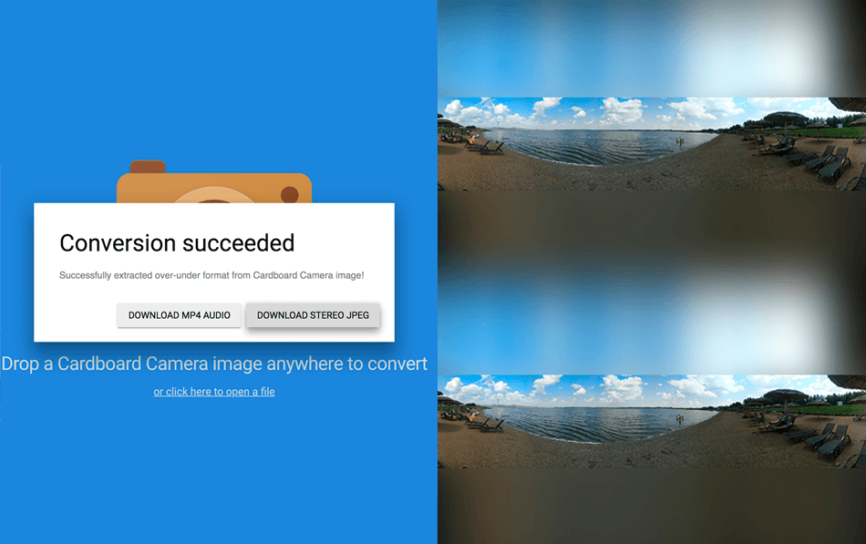{:.tmp}

## &nbsp;
{:.center}
[https://glitch.com/edit/#!/cardboard-camera-360](https://glitch.com/edit/#!/cardboard-camera-360)
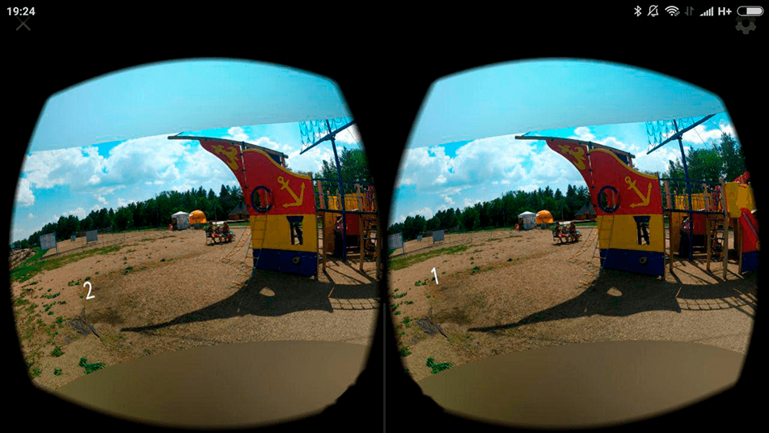{:.tmp}

## &nbsp;

- Отображение данных OSM в webVR - [osm-to-aframe](https://bastsoft.github.io/osm-to-aframe/map.html)
- aframe-school - [https://aframe.io/aframe-school](https://aframe.io/aframe-school)
- Martin Splitt — [WebVR with A-Frame](https://www.youtube.com/watch?v=9SgDOtfuYhc)

## **Контакты** {#contacts}

{{ site.author.name }}

    
{{ site.author.position }}

    

        
+7 (922) 755-66-59

        
compsober@yandex.ru

        
@bastsoft

        <!-- 
vk
 -->
        
petrilaptev

    

