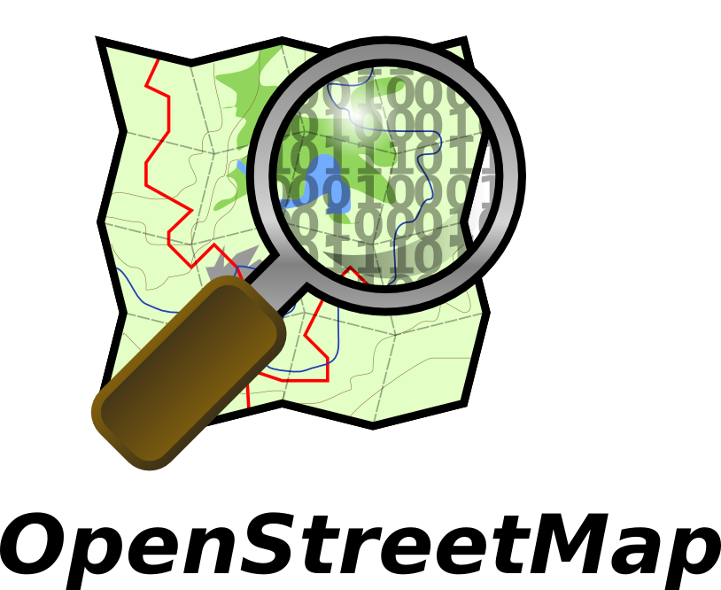
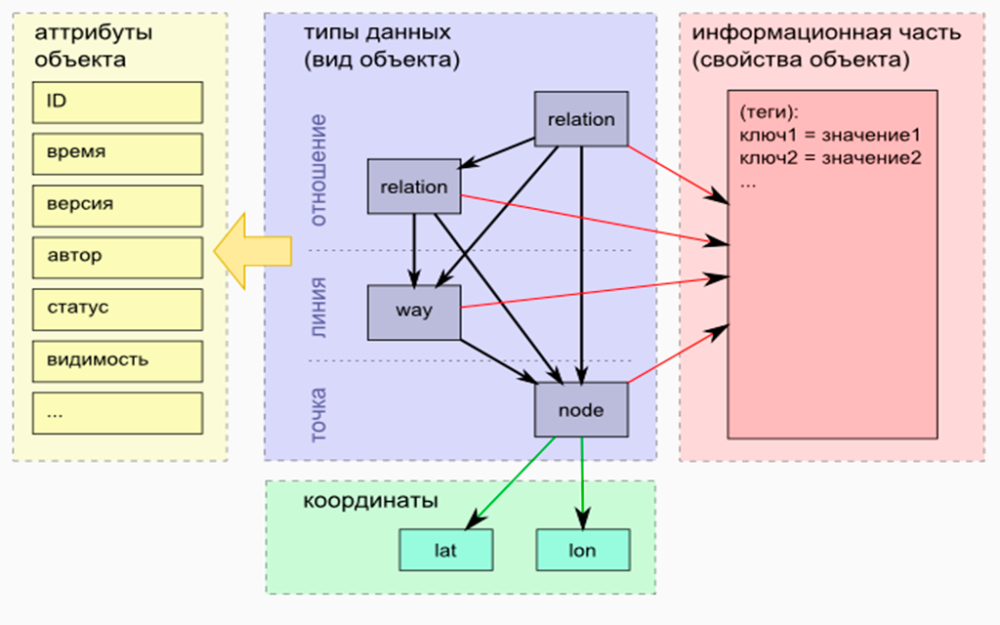
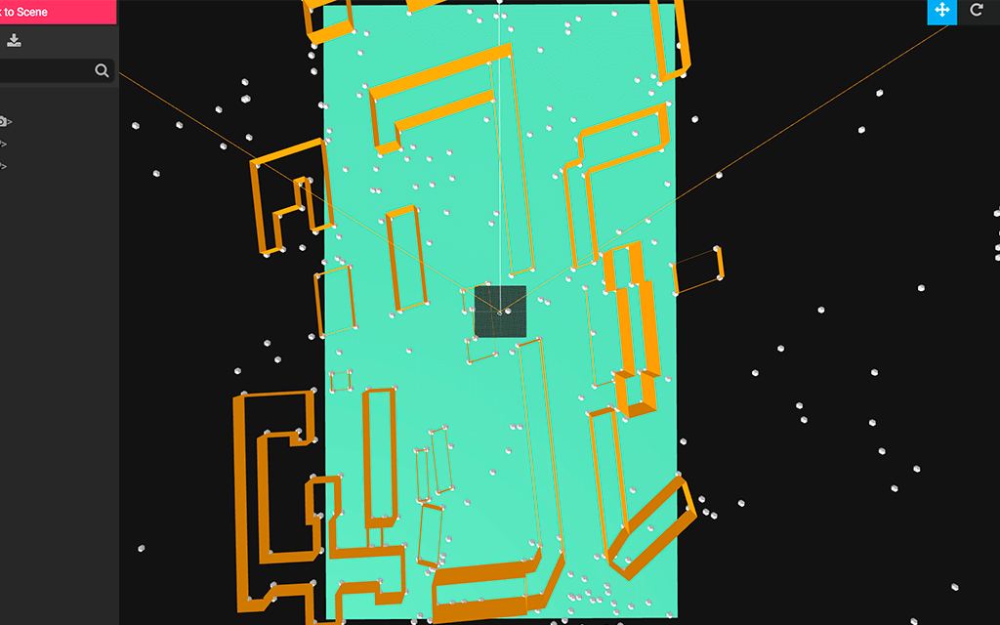

---

layout: default

title: VR in web

---

#  {#splash}

## **{{ page.title }}**

	
{{ site.author.company.name }}   {{ site.author.name }}

## &nbsp;
{:.images .two}

<!-- blank line -->

  <iframe width="420" height="315" src="https://www.youtube.com/embed/zA2tSoXCOnk?start=120" frameborder="0" allowfullscreen></iframe>
   
  
  <a target="_blank" href="https://www.youtube.com/watch?v=zA2tSoXCOnk&t=447s">
  Cycling Britain in VR. 1400-1500km
  </a>
  

  <iframe width="420" height="315" src="https://www.youtube.com/embed/jKrywMKnsUc" frameborder="0" allowfullscreen></iframe>
   
   
    <a target="_blank" href="https://www.youtube.com/watch?v=jKrywMKnsUc&t=300s">
    VR Cycling Experience
    </a>
   

<!-- blank line -->

## &nbsp;
{:.with-big-quote}
> как отобразить 3D в браузере?

{:.note}

## WebGL

{:.right-image}

* API к GPU
    * HTML5 canvas
    * OpenGL ES 2.0
    * GLSL ES 1.1
    * 2D/3D

## caniuse webgl
{:.center}
[https://caniuse.com/#feat=webgl](https://caniuse.com/#feat=webgl)
{:.tmp}

## 
{:.cover}

## 
{:.cover}

## 
{:.cover}

## scene
{:.center}

{:.tmp}

## mesh
{:.center}

{:.tmp}

## &nbsp;
{:.with-big-quote}
> как работать с VR в браузере?

{:.note}

## WebVR

{:.right-image}

* navigator.getVRDisplays
    * VRDisplay.requestAnimationFrame
    * VRDisplay.getImmediatePose
    * VRPose.position
    * VRPose.orientation
    * Gamepad.displayId

## caniuse webVR
{:.center}
[https://caniuse.com/#search=WebVR](https://caniuse.com/#search=WebVR)
{:.tmp}

## A-FRAME

{:.right-image}

* [https://aframe.io/](https://aframe.io/)
* Features
    * Simple, Declarative HTML
    * entity-component-system (ECS)
    * visual 3D inspector
* Base on
    * three.js

## AFrame - 360° Image
[demo](https://www.codeseek.co/preview/KyNwpZ)
~~~ html
<!DOCTYPE html>
<html>
<head>
  <title>AFrame - 360° Image</title>
</head>
<body>
<a-scene>
  <a-sky src="puydesancy.jpg" rotation="0 -130 0"></a-sky>
</a-scene>

</body>
</html>
~~~
{: .html}

## &nbsp;
{:.with-big-quote}
> данные

{:.note}

## &nbsp;
{:.images .two}

<!-- blank line -->

  <iframe width="420" height="315" src="https://www.youtube.com/embed/aJ_Dwpi5hm8" frameborder="0" allowfullscreen></iframe>
   
  
  <a target="_blank" href="http://osmgo.org/go.html?lat=55.75116999865&lon=37.62287&dir=0&view=-50&ele=150&user=user">
  osmgo.org
  </a>
  

  <iframe width="420" height="315" src="https://www.youtube.com/embed/IA8WrPEdBSQ?start=209" frameborder="0" allowfullscreen></iframe>
   
   
    <a target="_blank" href="https://osmbuildings.org/?lat=55.75116999865&lon=37.62287&zoom=19&rotation=-157&tilt=45">
    osmbuildings.org
    </a>
   

<!-- blank line -->

## &nbsp;

{:.right-image}

* [Simple 3D buildings](http://wiki.openstreetmap.org/wiki/Simple_3D_buildings)
* [Full 3D Building](https://wiki.openstreetmap.org/wiki/F3DB)
* [3D tagging](https://wiki.openstreetmap.org/wiki/3D_tagging)
* [3D development](https://wiki.openstreetmap.org/wiki/3D_development)

## 
{:.cover}

## 
{:.cover}

## osm-api-heroku xml to json and cors

[https://github.com/bastsoft/osm-api-heroku](https://github.com/bastsoft/osm-api-heroku)
~~~ javascript
    ctx.body = await fetch("https://www.openstreetmap.org" + ctx.url)
        .then(response => response.text()).then(function (xml) {
            const json = parser.xml2json(xml);

            json.bounds = [
                [json.osm.bounds.minlat, json.osm.bounds.minlon],
                [json.osm.bounds.maxlat, json.osm.bounds.maxlon]
            ];
            json.relation = _preprocessingReduce(json.osm.relation);
            json.way = _preprocessingReduce(json.osm.way);
            json.node = _preprocessingReduce(json.osm.node);
            delete(json.osm);

            return json;
        });
~~~
{: .language-javascript}

## &nbsp;
{:.with-big-quote}
> отображение osm данных

{:.note}

## builder with DOM createElement

~~~ javascript
   const createElem = function (arrElem) {
        const Elem = document.createElement(arrElem[0]);

        Object.keys(arrElem[1] || {}).forEach(function (key) {
            Elem.setAttribute(key, option[key]);
        });

        (arrElem[2] || []).forEach(function (elem) {
            Elem.appendChild(createElem(elem));
        });

        return Elem;
    };
    ...
    sceneEl.appendChild(createElem(['a-dodecahedron', {
        position: [currentPoint.x, 0, currentPoint.y].join(" "),
        color: "#CCC",
        radius: "0.1"
    }])) 
~~~
{: .language-javascript}

## 
{:.cover}

## math.js

~~~ javascript
const calculateMidPoint = function (maxX, minX, maxY, minY) {
    return { x: (maxX + minX) / 2, y: (maxY + minY) / 2};
};
const calculateLengthSegment = function (x1, y1, x2, y2) {
    return Math.sqrt(Math.pow((x1 - x2), 2) + Math.pow((y1 - y2), 2));
};

const calculateAngleBetweenTwoStraight = function (P0, P1, P2) {
    const delt_x1 = P1.X  - P0.X ;
    const delt_y1 = P0.Y  - P1.Y ;

    const delt_x2 = P2.X  - P0.X ;
    const delt_y2 = P0.Y  - P2.Y ;

    const angle1 = Math.atan2(delt_x1, delt_y1) * 180 / Math.PI ;
    const angle2 = Math.atan2(delt_x2, delt_y2) * 180 / Math.PI ;

    return angle2 - angle1;
};
~~~
{: .language-javascript}

## 
{:.cover}

## 
{:.cover}

## 
{:.cover}

## &nbsp;
{:.with-big-quote}
> контроллер для cardboard

{:.note}

## Controllers in a-frame

~~~ javascript
//3 degrees of freedom (3DoF) 
<a-entity daydream-controls></a-entity>
<a-entity gearvr-controls></a-entity>
//6 degrees of freedom (6DoF)
<a-entity vive-controls="hand: left"></a-entity>
<a-entity vive-controls="hand: right"></a-entity>
<a-entity oculus-touch-controls="hand: left"></a-entity>
<a-entity oculus-touch-controls="hand: right"></a-entity>

<a-entity hand-controls="left"></a-entity>
<a-entity hand-controls="right"></a-entity>

//tracked-controls
<a-entity tracked-controls="controller: 0; idPrefix: OpenVR"></a-entity>
~~~
{: .language-javascript}

## 
{:.cover}

## 
{:.cover}

##  Asset Management System

~~~ javascript
<a-scene>
    <a-assets>
        
        
    </a-assets>
</a-scene>
~~~
{: .language-javascript}
~~~ javascript
['a-plane', {
    //...
    material: "src: #window1; repeat: " + c + " " + l + "; side: double"
}]
~~~
{: .language-javascript}
~~~ javascript
['a-sky', {src: "#sky"}]
~~~
{: .language-javascript}

## &nbsp;
{:.with-big-quote}
> проблемы с крышей

{:.note}

## 
{:.cover}

## buildingCover

~~~ javascript
AFRAME.registerGeometry('buildingCover', {
    schema: { vertices: {default: []}, height: {default: 0}},
    init: function (data) {
        const pts = data.vertices.map(function (vertex) {
            const points = vertex.split(' ').map(x => Number(x));

            return new THREE.Vector2(points[0], points[1]);
        });
        const shape = new THREE.Shape(pts);
        const geometry = new THREE.ShapeGeometry(shape);

        geometry.vertices = geometry.vertices.map(
            v => new THREE.Vector3(v.x, Number(data.height), v.y)
        );

        this.geometry = geometry;
    }
});
~~~
{: .language-javascript}

## add buildingCover

~~~ javascript
elem.push(['a-entity', {
    geometry: "primitive: buildingCover; vertices: " + vRoof.join(", ") + "; height: " + (height + minHeight),
    material: 'color:orange; side:double'
}]);
~~~
{: .language-javascript}

## 
{:.cover}

## 
{:.cover}

## &nbsp;
{:.with-big-quote}
> планы

{:.note}

## 
{:.cover}

## 
{:.cover}

## 
{:.cover}

## 
{:.cover}

## &nbsp;
{:.images .two}

<!-- blank line -->

  <iframe width="420" height="315" src="https://www.youtube.com/embed/MJPvtx1zymk" frameborder="0" allowfullscreen></iframe>
   
  
  <a target="_blank" href="https://www.youtube.com/watch?v=MJPvtx1zymk">
  Google Maps APIs Gaming
  </a>
  

  <iframe width="420" height="315" src="https://www.youtube.com/embed/0MWmfsbm3-o" frameborder="0" allowfullscreen></iframe>
   
   
    <a target="_blank" href="https://www.mapbox.com/unity/">
    Mapbox Unity SDK
    </a>
   

<!-- blank line -->

## &nbsp;

- проект : [https://bastsoft.github.io/osm-to-aframe/map.html](https://bastsoft.github.io/osm-to-aframe/map.html)
- [по произвольным координатам (только в Chrome)](https://bastsoft.github.io/osm-to-aframe/)
- Структура данных проекта OpenStreetMap : [статья на habrahabr](https://habrahabr.ru/post/146503/)
- Василика Климова — [vasilika.ru](https://www.vasilika.ru/)
- Мстислав Живодков 2GIS -  [Как мы ускоряли WebGL](https://www.youtube.com/watch?v=MeIJVg1z00A)
- Владимир Агафонкин - [Современные интерактивные карты](https://www.youtube.com/watch?v=yMmyzzApGy4)

## **Контакты** {#contacts}

{{ site.author.name }}

    
{{ site.author.position }}

    

        
+7 (922) 755-66-59

        
compsober@yandex.ru

        
@bastsoft

        <!-- 
vk
 -->
        
petrilaptev

    

